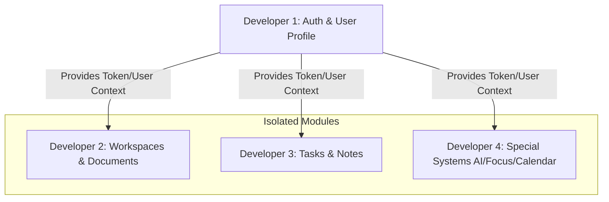
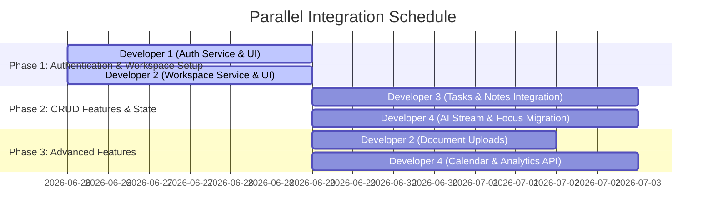

# Frontend-Backend Integration Plan: 4-Developer Parallel Strategy

This plan outlines the division of tasks for connecting the Flutter mobile frontend to the backend server. The work is split among **4 developers** to minimize code interference, avoid git merge conflicts, and allow parallel progress.

---

## 🛠️ Architecture & Shared Resources (Baseline)
To prevent developers from stepping on each other's toes, we establish the following baseline:
*   **API Client (`lib/services/api/api_client.dart`):** Already contains the central HTTP routing and streaming client. Developers must only use `ApiClient()` rather than creating custom HTTP helpers.
*   **Main Entry Point (`lib/main.dart`):** Already has the necessary routes and providers registered. Developers should avoid editing this file unless explicitly creating a new provider (see Developer 4).
*   **State Management Separation:** To keep shared state files like `AppState` clean, we partition state responsibilities per developer.

---

## 👥 Developer Allocation & Scope

### 👤 Developer 1: Authentication & User Profile (Foundation)
*   **Focus:** Core authentication state, user session lifecycle, user details, and support utilities.
*   **Directory & File Scope:**
    *   `lib/services/api/auth_service.dart`
    *   `lib/providers/auth_provider.dart`
    *   `lib/screens/auth/` (Splash, Login, Register, Permission screens)
    *   `lib/screens/profile/` (Profile and user settings screens)
    *   `lib/screens/support/` (Help and privacy policy screens)
*   **Key Tasks:**
    1.  Integrate login/signup endpoints with the backend.
    2.  Handle persistent storage of the JWT token via `SharedPreferences`.
    3.  Implement token expiration handling and automatic logout flows.
    4.  Fetch user profile data and implement edit/update profile API calls.

---

### 📁 Developer 2: Workspace Management & Document Integration
*   **Focus:** High-level group containers (Workspaces) and document management (binary file uploads/downloads).
*   **Directory & File Scope:**
    *   `lib/services/api/workspace_service.dart`
    *   `lib/services/api/document_service.dart`
    *   `lib/providers/workspace_provider.dart`
    *   `lib/screens/workspace/` (Workspace CRUD, sidebar, selection, headers)
    *   `lib/screens/workspace_items/` -> Only `document_list.dart` and `document_card.dart`
*   **Key Tasks:**
    1.  Connect workspace listing, creation, and deletion to the backend API.
    2.  Implement switching active workspaces, modifying workspace metadata (colors, names, icons).
    3.  Connect document upload, download, and listing APIs (utilizing multipart requests where necessary).

---

### 📝 Developer 3: Core Workspace Items (Tasks & Notes CRUD)
*   **Focus:** Managing text-based productivity items (Tasks and Notes) inside workspaces.
*   **Directory & File Scope:**
    *   `lib/services/api/task_api_service.dart`
    *   `lib/services/api/note_api_service.dart`
    *   `lib/screens/workspace_items/` -> `task_list.dart`, `task_card.dart`, `note_list.dart`, `note_card.dart`
    *   `lib/providers/app_state.dart` (Strictly the workspace items sections and `loadAllDataFromBackend()`)
*   **Key Tasks:**
    1.  Connect task listing, addition, deletion, and status changes (e.g., complete/incomplete) to the task APIs.
    2.  Connect note creation, listing, editing, and deletion to the note APIs.
    3.  Integrate local caching fallback for tasks/notes when offline.

---

### 🧠 Developer 4: Special Systems (AI, Focus, Calendar, & Notifications)
*   **Focus:** Rich interactive features including AI chat streaming, calendar sync, Pomodoro focus tracking, notifications, and analytics.
*   **Directory & File Scope:**
    *   `lib/providers/ai_provider.dart`
    *   `lib/services/api/calendar_service.dart`
    *   `lib/screens/ai/` (AI Sidebar, Chat, input widgets, dialogs)
    *   `lib/screens/calendar/` (Calendar views, agendas, event syncing)
    *   `lib/screens/focus/` (Focus timer, posting completed sessions to backend)
    *   `lib/screens/analytics/` (Analytics dashboards, productivity logs)
    *   `lib/screens/notifications/` (Push notifications and history)
*   **Key Tasks:**
    1.  Connect the AI chat service, implementing support for NDJSON stream response streaming.
    2.  Integrate the calendar view to fetch agenda events from the backend service.
    3.  Send completed focus sessions to the backend and pull analytics charts data.
    4.  Set up background notification receivers and show notifications history.

---

## ⚡ Merge Conflict Mitigation Strategies

To ensure developers do not block one another, the following engineering boundaries must be respected:

### 1. Extract Focus State from `AppState` (Action for Developer 4)
Currently, `AppState` (`lib/providers/app_state.dart`) stores both focus session logic and workspace items (tasks/notes).
*   **Problem:** If Developer 3 and Developer 4 edit the same file, Git conflicts will occur frequently.
*   **Resolution:** Before building the focus timer API integration, **Developer 4 should extract Focus session state** into a dedicated `FocusProvider` (e.g., `lib/providers/focus_provider.dart`). This isolates Focus sessions completely. Developer 4 will then register `FocusProvider` in `main.dart` once.

### 2. Isolate Models
*   Developers should only touch their respective models in `lib/models/`:
    *   Developer 1: `user.dart` (if applicable)
    *   Developer 2: `workspace/workspace.dart`, `workspace_items/document.dart`
    *   Developer 3: `workspace_items/task.dart`, `workspace_items/note.dart`
    *   Developer 4: `focus_session.dart`

### 3. Clear Boundaries in shared API clients
*   `lib/services/api/api_client.dart` is **read-only** for all developers. If custom headers or new methods are needed, request changes through the team lead, or ensure additions are non-breaking.

---

## 📅 Integration Timeline & Dependencies

1.  **Blocker 1 (Auth):** Developers 2, 3, and 4 depend on Developer 1 completing the JWT token saving mechanism. During Phase 1, other developers can bypass this by hardcoding a mock JWT token in `api_client.dart`'s headers helper.
2.  **Blocker 2 (Workspaces):** Developer 3 (Tasks & Notes) and Developer 2 (Documents) require workspace IDs. They should coordinate on the Workspace model structure and use mock Workspace IDs until Developer 2 finishes the workspace endpoints.
